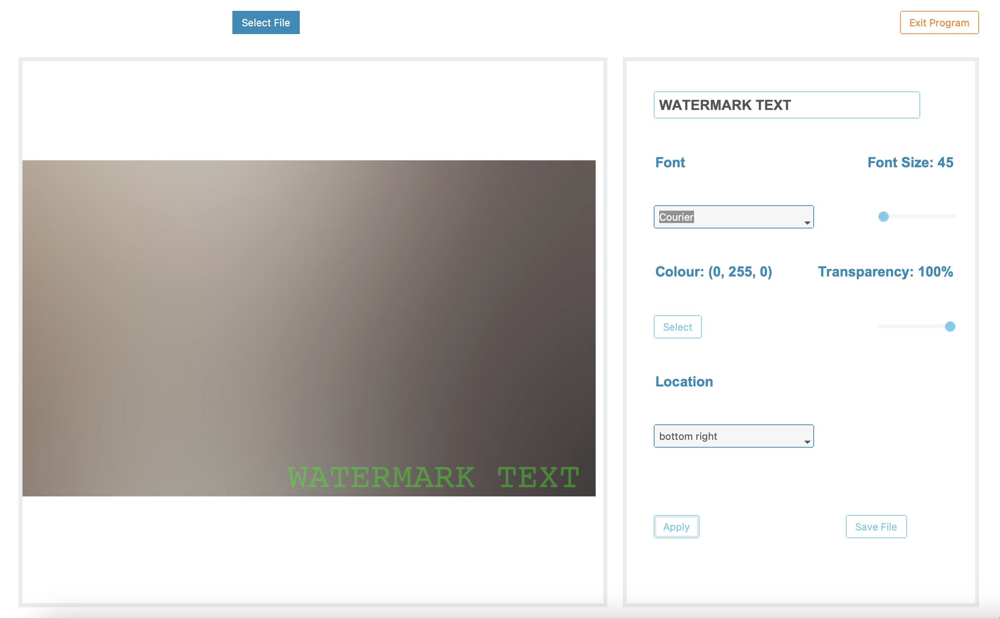
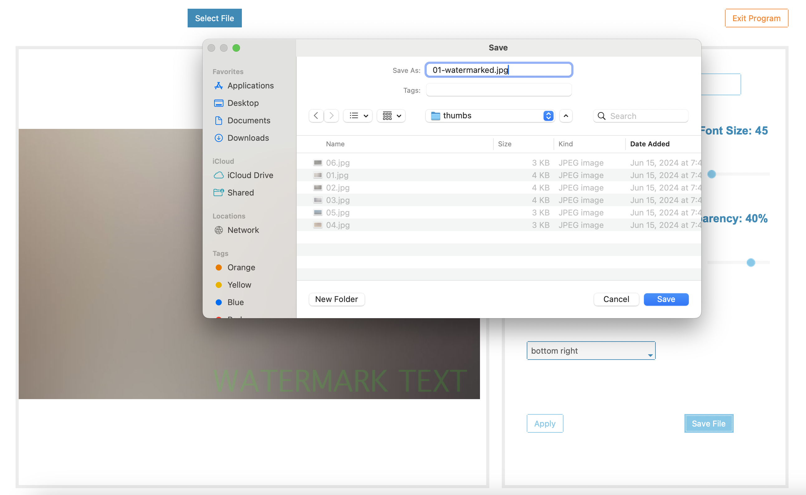

# Image Watermark Desktop App

Add text watermarks to images using this app, which allows you to customize the
font, text size, colour, transparency, and placement. 

Future iterations may include the ability to add images as watermarks.

## Usage

To run: 

```
poetry run python main.py
```

## Screenshots





